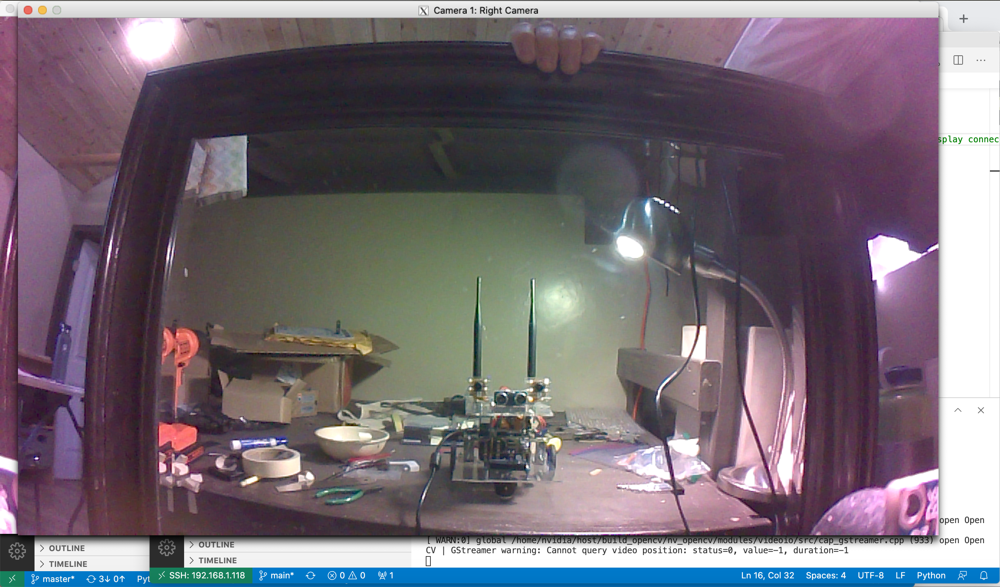
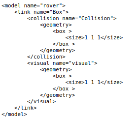
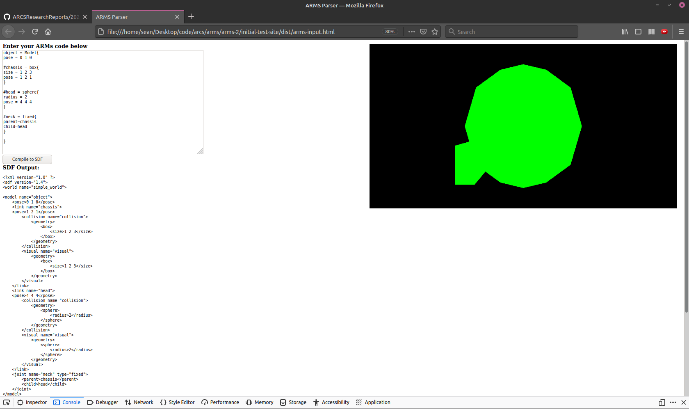
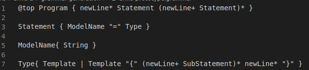
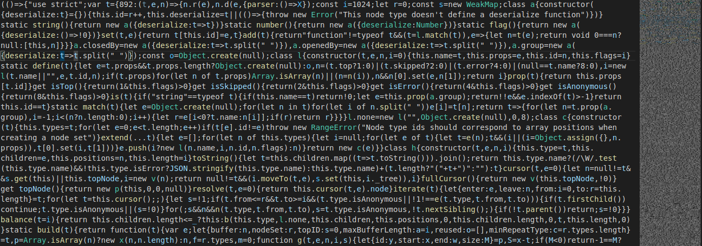

# Spring 2021 report on the Autonomous Robotics Markup Syntax (ARMS):
## A language and browser app to easily generate verbose robotics simulations

Author: Sean O'Connor ([swow2015](https://github.com/swow2015/))

This report documents my work over the Spring 2021 semester for the Autonomous Robotics and Complex Systems (ARCS) lab at Pomona College, headed by Professor [Anthony Clark](https://cs.pomona.edu/~ajc/).  It's intended to provide a guide for anyone interested in continuing my work, including an overview of the project, tutorials for getting started, and explanations of areas I found to be confusing or difficult.

## Project Background
Simulations play an important role in robotics as a medium for tests that would be difficult and/or costly in real life.  For example, when designing a robot's chassis, we might want to know which shape will give us the best performance.  Testing multiple shapes in real life would require building multiple physical robots at a significant expense of materials and time, only to discard them once the best build is discovered.  Through simulation, however, we can eliminate such costs by testing each potential design virtually and then only building one robot using the best design in reality.  Such capability even allows optimization that might be prohibitively expensive outside of simulation, such as comparing hundreds of chassis designs with minor differences to find the optimal values for parameters like length, height, etc.

  
*A selfie taken by an ARCS lab robot showing it under construction.*

One issue with such simulations, however, is that many commonly used robotics simulation tools require verbose and complicated input to create each simulation.  For instance, popular tool [Gazebo](http://gazebosim.org/) uses the XML-based [SDFormat](http://sdformat.org/) language.  Below is the code required to create a simple 1x1x1 cube object:



Look at all those tags!  I'm getting a headache already.  Wouldn't it be nice if instead we could write something like this?
```
robot_body = Box{
    size = 1 1 1
}
```

Or, let's say we want to make a bunch of cubes to try many different body shapes for our robot; what if we could define a template called simple_cube to reduce the code even more to something like this?

```
robot_body = simple_cube(1, 1, 1)
```

This is the goal of ARMs: create a simple language that can generate robotics simulations in shorter, more legible code and supports useful features like user-defined parameterized templates.  Not only would such a language make simulation easier, but it could also be automatically translated into formats for multiple simulation tools such as [DART](https://dartsim.github.io/) and [URDF](http://wiki.ros.org/urdf).  Eventually, we hope to use such functionality to explore aggregating data from multiple simulation engines as a technique for obtaining more realistic simulation results.

Over the Spring 2021 semester, I began creating ARMs as an in-browser javascript app that translates user input to SDF language.  My semester goals for the app were:

- Define a concise and intuitive ARMS language that offers similar power to SDF in a condensed, easier-to-use syntax.
- Create a javascript parser for ARMS and an evaluator that translates the parsed input to SDF
- Build a simple web interface into which the user can input ARMS, receive an SDF translation, and instantly see a preliminary visualization of their scene in-browser.

## Current State of the App:

The source code for the app can be found [here](https://github.com/swow2015/arms2).  The app can be quickly demoed by downloading "dist/main.js" and "dist/app.html".  With these two in the same directory, you can simply open the HTML file and the app will run.

  
*Current state of the ARMs app*

The app currently supports the following (see image above):
- All objects are contained in a Model.  Top-level statements should be a model definition of the form `ModelName = Model{ Definition }`.
- A model definition can contain two types of sub-statements: model-wide parameters, defined like `parameter = value`, and child objects, defined `#objectName = primitive{ parameters}`
- Currently the only model-wide parameter supported is `pose`; this will be added to the SDF but not shown in the browser visualization.
- Supported primitive types for objects include `box`, `sphere`, and `fixed`.
- `box` is a cuboid object that supports the parameters `pose` and a three-number `size`.
- `sphere` is a sphere object that supports the parameters `pose` and `radius`.
- `fixed` is a fixed joint that requires the parameters `parent` and `child`, both of which should be the objectNames of two other objects in the same model.  Joints aren't rendered in the browser but are added to the SDF.

## Setup and Technologies

### Making a Language and Parser with Lezer

Writing a tokenizer and parser by hand would be a lot of work, especially since the ARMS language is likely to change throughout development.  So I decided to use [Lezer](https://lezer.codemirror.net/): a tool that can automatically create a Javascript parser for a user-defined language.  This not only saves time, but makes changing ARMS during an incremental development process relatively simple.  The first step was to formally define the ARMS language in a .grammar file, using a format roughly equivalent to a context-free grammar:

   
*Part of the ARMS grammar during early development*

A full guide to creating a Lezer grammar is available [here](https://lezer.codemirror.net/docs/guide/).  The gist is that the language is defined as a context-free grammar, with each rule defined in the format `RuleName{ RuleDefinition }`.  The RuleDefinition can contain Rulenames, tokens, and can use regular expression operators like `*` (Kleene star), `|` (or), `+` (one or more), etc.  Tokens are defined in an `@tokens` block, with each token being a regular expression (the Lezer-generated file will perform both lexing and parsing).

With a complete .grammar file in hand, the next step was to generate the parser.  Lezer is distributed as a series of three Node Packages: lezer, lezer-generator, and lezer-tree.  To use them, I had to install [Node](https://nodejs.dev/learn/how-to-install-nodejs) and [NPM](https://docs.npmjs.com/downloading-and-installing-node-js-and-npm).  There are two ways of installing Node packages: [locally](https://docs.npmjs.com/downloading-and-installing-packages-locally) or [globally](https://docs.npmjs.com/downloading-and-installing-packages-globally).  I found the simplest method was to locally install all Lezer packages in my project directory.  This can be done by navigating to the project directory in the terminal and running:

```shell
npm install lezer
npm install lezer-generator
npm install lezer-tree
```

Running any one of these commands will generate the file "package.json" and the directory "node_modules" in your current directory.  These constitute your local npm environment: the packages are listed in package.json and stored in node_modules.  Packages installed this way can only be accessed within this directory.

Once I had these packages installed, I generated a parser for my grammar by running the following shell command (again this must be done in your project directory):
```shell
npx lezer-generator path/to/your_file.grammar -o path/to/parser_filename.js
```

This will generate the file "parser_filename.js", which I then imported into my code like so:

```javascript
const arms = require("./path/to/parser_filename.js");
```

### Javascript Bundling
This would be all well and good if we were going to run our project with Node, but browser javascript doesn't support importing Node packages in this way.  So to actually use our parser, we'll have to use a **bundler**: a program that will find all the code our project depends on and combine it into one massive self-sufficient javascript file:

  
*The bundled javascript file for ARMS...holy wall of text!*

I had the most success with [webpack](https://webpack.js.org/).  Similar to lezer, webpack is available through npm and I found it easiest to install locally in my project directory using:

```shell
npm install webpack
```

When run, by default webpack looks for the file "./src/index.js" and uses it as the **entry point** for bundling.  That is to say, it generates a dependency graph by starting at index.js and looking for every file that it imports, then looking at every file those import, and so on.  After finding all code that the entry point depends on, it packs it all into one independantly runnable file: by default, "./dist/main.js".  I found it easiest to just work with these defaults by setting up my project directory to match them: I created a sub-directory called 'src' containing my main application code in a file named 'index.js'.  I then created another sub-directory 'dist' and built the web interface around the bundled file 'main.js' stored there.

After these 'src' and 'dist' subdirectories were created and my parser code was in the file './src/index.js', I generated the runnable bundled file by running:

```shell
npx webpack
```

This command can be run again anytime changes are made to index.js to re-compile the bundled file.

### Running the Parser

With this setup out of the way, we're ready to use the parser.  To parse string of ARMS code, we can use the following:

```javascript
const arms = require("./path/to/parser_filename.js");

var code = "ARMs code here";
var tree = arms.parser.parse(code);
```

And that's it!  We now have a parse tree for our code stored in the variable `tree`.  Lezer provides navigation through its parse trees with **cursors**; these are objects representing a node on the tree that let us read information and move directionally to siblings, children, or parents.  Here's the basics of how to use them:

- Declaring a cursor, initialized to be at the top of the tree
```javascript
let cursor = tree.cursor();
```
- Moving to a cursor's child, sibling, or parent (these returns False if not successful)

```javascript
cursor.firstChild();
cursor.nextSibling();
cursor.parent();
```
- Getting the type of the current node (that is, the grammar rule that it was matched with)
```javascript
cursor.name;
```

- Getting the actual code that was parsed as the current node--confusingly, these are not actually stored in the nodes themselves.  Instead, nodes store "to" and "from" integers that represent indices in the original string of code.  These indices mark the slice of the code string that was parsed as matching the current node's grammar rule:
```javascript
code.slice(cursor.from, cursor.to);
```

Full documentation of the [tree](https://lezer.codemirror.net/docs/ref/#tree.Tree), [cursor](https://lezer.codemirror.net/docs/ref/#tree.TreeCursor), and more on [Lezer](https://lezer.codemirror.net/docs/guide/) are available on the Lezer website.

### Visualizing with ThreeJS
It can be hard to spot errors in text descriptions of three-dimensional objects.  So to ease the process of writing ARMS code, our app creates a preliminary in-browser visualization of the user's scene using [ThreeJS](https://threejs.org/).  I installed ThreeJS as a local NPM similarly to before, using:

```shell
npm install three
```

Most of my code comes directly from the ThreeJS [documentation](https://threejs.org/docs/index.html#manual/en/introduction/Creating-a-scene).  To initialize the scene:

```javascript
import * as THREE from 'three';

const scene = new THREE.Scene();
const camera = new THREE.PerspectiveCamera( 75, window.innerWidth / window.innerHeight, 0.1, 1000 );

const renderer = new THREE.WebGLRenderer();
renderer.setSize( window.innerWidth/2, window.innerHeight/2 );
camera.position.set(4, 4, 8);

```

I found the default camera position of 4, 4, 8 works reasonably well for displaying small objects near (0, 0, 0); however, I hope to eventually set the camera position dynamically to ensure the entire scene is displayed.  I also set the scene to take up 1/4 of the browser window.  After initialization, a DOM element representing the scene needs to be appended to the HTML document.  I created an empty div in my HTML page with the id "scene" as a placeholder for the visualization, then added the visualization with the following code:

```javascript
var sceneContainer = document.getElementById("scene");
var domScene = sceneContainer.appendChild( renderer.domElement );
```

Finally, during initialization the scene needs to be animated, as follows:

```javascript
function animate() {
	requestAnimationFrame( animate );
	renderer.render( scene, camera );
}

animate();
```

Objects can then be dynamically added to the scene when evaluating the user's ARMS code.  For example, to add either a box or a sphere:

```javascript
var geometry;
  if(objectType === "box"){
    geometry = new THREE.BoxGeometry();
  }
  else if(objectType === "sphere"){
    geometry = new THREE.SphereGeometry(radius);
  }

  const material = new THREE.MeshBasicMaterial( { color: 0x00ff00 } );
  const tjsObject = new THREE.Mesh( geometry, material );
  scene.add(tjsObject);
```

The object's position can be updated as follows:
```javascript
var coords = [1, 2, 3];
tjsObject.position.set(coords[0], coords[1], coords[2]);
```

The size of the object can also be updated by scaling it along all three axes:
```javascript
var scale = [1, 2, 3];
tjsObject.scale.set(scale[0], scale[1], scale[2]);
```

One tricky part is clearing objects from the scene, for example when resetting the visualization if the user enters new ARMS code.  Material and Geometry objects are not deleted automatically with their parent object, and need to have their dispose() method called individually to avoid a memory leak.  I used the following code to remove all objects from the scene:
```javascript
scene.children.forEach(object => {
    object.material.dispose();
    object.geometry.dispose();
  });
  scene.clear();
```

And that completes the visualization!

### Putting it all together

With the language written, the Lezer parser generated, and the code that runs it bundled using webpack into a file main.js, our code can now be easily imported into an HTML file with just one script tag:
```html
<script src="main.js"></script>
```
Don't forget (like I did) that scripts should be the last thing before the closing `</body>` tag; otherwise, DOM elements they interact with may not have fully loaded when the script runs, causing errors.  To make the functional app, I simply added a `<textarea>` for the user to input ARMS code, an empty `div` for the output to be displayed in, and a `<button>` to compile the code.  The main program function is bound to run when the user clicks the button with an an `eventListener` as follows:

```javascript
var button = document.getElementById("compile");
button.addEventListener("click", parseArms);
```

The user's ARMS code can be gotten from the text area and parsed as follows:

```javascript
var input = document.getElementById("input");
var code = input.value;
var tree = arms.parser.parse(code);
```

And just like that, we have a running parser!  Here's some simple test code that will then walk through the entire parse tree and log each node to the console:
```javascript
var cursor = tree.cursor();

while(cursor.next()){
    console.log(cursor.name);
    console.log(code.slice(cursor.from, cursor.to));
  }
```


## The development process

With all the technology for parsing and visualizing in place, I set about implementing code to evaluate the parsed input.  I started with the ability to simply create an empty model, which would contain various objects (links) and relationships between them (joints).  I then implemented a cube primitive type, followed by support for parameters determining size and position.  Spheres with a parameter-determined radius came next, followed by primitive fixed joints.  Adding each feature entailed:
- Making any necessary updates to the grammar
- Updating the way the parse tree is walked and evaluates the user's input
- Generating the new feature in SDF
- Adding a visualization with ThreeJS

The logic of the language, parsing and evaluation was complex and difficult to entirely plan out ahead of time.  At first, I thought that I should design the whole language and plan the overall structure of the app at the outset.  But I quickly found that plans laid too far ahead were ultimately discarded as the language needed to evolve throughout the development process in unexpected ways.  I eventually settled into an incremental development process not just for the codebase, but the ARMS language itself.

One consequence of this is that I often couldn't predict exactly how to modularize the code or what kind of control flow to use that would best fit with future features.  As a result, I found midway through the semester that the codebase was starting to get quite messy, and I ended up doing doing two major re-organizations during the latter part of the semester.  I found I could avoid the need for these large re-organizations by taking a moment every time I introduced a major new feature to ask: can any existing code be re-organized in order to be re-used for this?  I also found that it helped to build in time for cleaning up the code every so often and keeping things well-commented and organized as I went.

Another challenge I encountered was reading documentation.  As opposed to big languages like Python with extensively-developed documentation and readily available tutorials on any issues that might arise, smaller tools like Lezer had documentation that was quite sparse in places.  When circling a gap in the available documetation, I found sometimes the way forward was to make a minimal test program and just explore the behavior of underdocumented features myself.  Another solution that helped me was finding source code for another person's project that uses the tool, and reading through their source code to find how they accomplished the task.


## Tricky points / nuances

Two especially tricky challenges came up in the design of the ARMS grammar:

- When defining rules based on keywords, conflicts arose as Lezer couldn't differentiate between a specific keyword and a string token.  For example, consider using the "template" keyword in a grammar to implement user-defined Template definitions:
```
Template{ "template" TemplateName TemplateDefinition }
@tokens{
  string{ (std.asciiLetter | std.digit)* }
}
```

Lezer won't generate this grammar because it can't determine whether the input "template" should be parsed as the start of a Template definition or as a string token of the word "template".  While Lezer provides a way to set some rules as having a higher precedence, this isn't an ideal solution because it will cause inputs like "templates" to be interpreted as the keyword "template" followed by the TemplateName "s".  Instead, the solution is to use the @specialize operator, which defines a keyword as a special occurence of another token.  For example, we can re-work our definition above to define the "template" keyword as a special occurrence of a string:
```
Template{ @specialize<string, "template"> TemplateName TemplateDefinition }
@tokens{
  string{ (std.asciiLetter | std.digit)* }
}
```

This will make our parser check anytime it parsers a string whether it's an instance of the keyword "template", resolving the ambiguity.

- Another somewhat confusing issue that came up was making exceptions to skip rules.  Skip rules are tokens that Lezer will ignore when parsing, which is useful for allowing things like comments or the stylistic use of vertical whitespace.  One thing I found useful to skip was spaces, for example to allow the user to either enter either `parameterName=value` or `parameterName = value` without needing to create special rules for both.  However, I also wanted to use spaces as part of string tokens to allow for example easily entering an expression like `scale = 4 5 6`.  Lezer allows the specification of a different skip rule to be used in certain rules, but to do so you have to define a new rule within the skip Block and use that rule within your grammar.  So, we can skip spaces normally, while allowing them to be used in strings:
```
@tokens {
  string { (std.asciiLetter | std.digit | space)+ }
  space { " " }
}

@skip{
  space
}

@skip{}{
  String{ string }
}
```

The first @skip expression is the one that will be used normally, meaning spaces will be skipped.  The second @skip expression is a rule to skip nothing (since nothing is between the first set of {} braces), meaning spaces will not be skipped.  The rules it applies within are specified within the second set of braces, here just a single rule named String.  The key point here is that we've defined a new String rule in the second skip rule, which is different than the string token starting with a lowercase "s".  As you can see from the definition, the String rule just immediately resolves to a string token, which may seem pointless.  But since it's defined in the new skip rule, it also means that within our String rule, spaces won't be skipped.  Note that this means the String rule should now be used in the rest of our grammar in place of wherever we would have used a string token, otherwise the new skip rule won't be applied.

Another tricky issue that came up was how to properly display SDF code in the HTML page:
- As an XML-based format, SDF contains a lot of opening and closing braces `<` and `>`.  However, if these characters are added to the HTML page, it won't render them because it interprets them as part of an HTML tag.  At the moment, the best solution I've found is to replace `<` with `&lt;` and `>` with `&gt;`.  Future work should consider looking into a javascript module for formatting XML.
- HTML also doesn't display most whitespace by default, making code indentation quite tricky.  The best workaround I found was to put all the output SDF in a `<pre>` tag, which HTML treats as pre-formatted and thus renders any whitespace normally.  However, I found that the use of `\t` characters to put more space than was desired for an indent, so for the moment I used four spaces `"    "` for each indent.  This works, but is tough to look at and tedious to update, so again it would be worth looking into a better solution going forward.

## Next steps

Much work remains to be done on the project.  Some possibilities for immediate next steps include:

- Many primitives from SDF can still be implemented: cylinders, rotational joints, etc.  This is fairly low-hanging fruit.
- Specialize tags can be used to implement more logical keywords for Model and Object definitions rather than the special symbols that are currently in use.
- Parameter values should be more strictly enforced.  For example, the scale of a Box should always be three numbers, but the user can currently put in anything.
- Relatedly, currently only the first three values of the pose parameter (the x, y, and z position) are rendered in the ThreeJS visualization.  Pose also specifies a rotation for the object; this needs to be implemented.
- If a model-wide pose is defined, the ThreeJS visualization ignorse it and renders link poses as absolute values rather than an offset from the model's pose.  This should be fixed.
- User-defined templates are a work in progress and need to be finished.
- Conditional expressions for use in user-defined templates should be defined.
- This is probably more of a long-term goal, but work can start on outputting languages other than SDF.  URDF and DART are two possible first choices.
- Better visuals should be implemented in both threejs and gazebo (lighting? shadow? coloring, outlining, materials?)
- Support can be added for other sdf properties such as surface, friction, etc
- Dynamic camera position should be set in threejs scene to allow visualization of all objects.  A rough idea for this is to get a bounding box for all objects in the scene, then use trigonometry based on the angle of the camera's FOV (default 75) to calculate the distance from the closest face of the box at which all 4 edges will be in view.
- The editor can be integrated with [CodeMirror](https://codemirror.net/) to give a nicer experience for entering code in the browser.  CodeMirror also supports automatically generating syntax highlighting and autocomplete from a Lezer grammar.
- The user should have the option to download their SDF as a file.
- If CodeMirror isn't yet integrated, two things that will improve quality of life in the textarea where code is entered are supporting scrolling up/down and allowing the user to indent with tabs.

For any questions, feel free to contact me through GitHub and I'd be happy to respond.  Thanks for reading!
